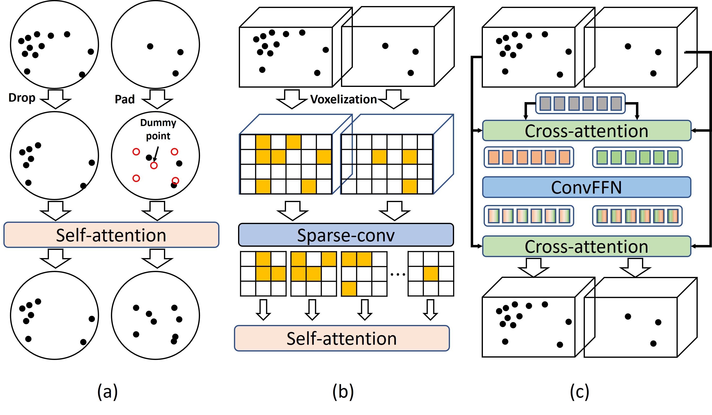

## Voxel Set Transformer: A Set-to-Set Approach to 3D Object Detection from Point Clouds (CVPR2022)[\[paper\]](https://www4.comp.polyu.edu.hk/~cslzhang/paper/VoxSeT_cvpr22.pdf)

**Authors**: [Chenhang He](https://github.com/skyhehe123), Ruihuang Li, [Shuai Li](https://github.com/strongwolf), [Lei Zhang](https://www4.comp.polyu.edu.hk/~cslzhang/).

This project is built on [OpenPCDet](https://github.com/open-mmlab/OpenPCDet).

## Updates
2022-04-09: Add waymo config and multi-frame input. 

The performance of VoxSeT (single-stage, single-frame) on Waymo valdation split (with 20% traning data) are as follows. The log file can be found [here](https://drive.google.com/file/d/1bsq2Fihz7EdnZdJYVhfr6bL8gx_Vz0Rd/view?usp=sharing).

|         |    Car AP/APH | Ped AP/APH | Cyc AP/APH  | 
|---------|--------|--------|--------|
|  Level 1 |   72.10/71.59 | 77.94/69.58  |  69.88/68.54  |
|  Level 2 |   63.62/63.17 | 70.20/62.51  |  67.31/66.02  |


## Introduction

Transformer has demonstrated promising performance in many 2D vision tasks. However, it is cumbersome to compute the self-attention on large-scale point cloud data because point cloud is a long sequence and unevenly distributed in 3D space. To solve this issue, existing methods usually compute self-attention locally by grouping the points into clusters of the same size, or perform convolutional self-attention on a discretized representation. However, the former results in stochastic point dropout, while the latter typically has narrow attention fields. In this paper, we propose a novel voxel-based architecture, namely Voxel Set Transformer (VoxSeT), to detect 3D objects from point clouds by means of set-to-set translation. VoxSeT is built upon a voxel-based set attention (VSA) module, which reduces the self-attention in each voxel by two cross attentions and models features in a hidden space induced by a group of latent codes. With the VSA module, VoxSeT can manage voxelized point clusters with arbitrary size in a wide range, and process them in parallel with linear complexity. The proposed VoxSeT integrates the high performance of transformer with the efficiency of voxel-based model, which can be used as a good alternative to the convolutional and point-based backbones.

### 1. Recommended Environment

- Linux (tested on Ubuntu 16.04)
- Python 3.7
- PyTorch 1.4 or higher (tested on PyTorch 1.10.1)
- CUDA 9.0 or higher (tested on CUDA 10.2)

### 2. Set the Environment

```shell
pip install -r requirement.txt
python setup.py build_dist --inplace 
```
The [torch_scatter](https://github.com/rusty1s/pytorch_scatter) package is required


### 3. Data Preparation

- Prepare [KITTI](http://www.cvlibs.net/datasets/kitti/eval_object.php?obj_benchmark=3d) dataset and [road planes](https://drive.google.com/file/d/1d5mq0RXRnvHPVeKx6Q612z0YRO1t2wAp/view?usp=sharing)

```shell
# Download KITTI and organize it into the following form:
├── data
│   ├── kitti
│   │   │── ImageSets
│   │   │── training
│   │   │   ├──calib & velodyne & label_2 & image_2 & (optional: planes)
│   │   │── testing
│   │   │   ├──calib & velodyne & image_2

# Generatedata infos:
python -m pcdet.datasets.kitti.kitti_dataset create_kitti_infos tools/cfgs/dataset_configs/kitti_dataset.yaml
```

### 4. Pretrain model
You can download the pretrain model [here](https://drive.google.com/file/d/1CdSWpxU03pdd0gQXLw3x5PMj7h_vifLW/view?usp=sharing) and the log file [here](https://drive.google.com/file/d/1_n50FBxFmGjyHvbBiqUSvbqF3WzCRIIt/view?usp=sharing).

The performance (using 11 recall poisitions) on KITTI validation set is as follows:
```
Car  AP@0.70, 0.70, 0.70:
bev  AP:90.1572, 88.0972, 86.8397
3d   AP:88.8694, 78.7660, 77.5758

Pedestrian AP@0.50, 0.50, 0.50:
bev  AP:63.1125, 58.5591, 55.1318
3d   AP:60.2515, 55.5535, 50.1888

Cyclist AP@0.50, 0.50, 0.50:
bev  AP:85.6768, 71.9008, 67.1551
3d   AP:85.4238, 70.2774, 64.9804
```
The runtime is about **33 ms** per sample.

### 5. Train

- Train with a single GPU

```shell
python train.py --cfg_file tools/cfgs/kitti_models/voxset.yaml
```

- Train with multiple GPUs 

```shell
cd VoxSeT/tools
bash scripts/dist_train.sh --cfg_file ./cfgs/kitti_models/voxset.yaml
```
### 6. Test with a pretrained model

```shell
cd VoxSeT/tools
python test.py --cfg_file --cfg_file ./cfgs/kitti_models/voxset.yaml --ckpt ${CKPT_FILE}
```
### Citation
```
@inproceedings{he2022voxset,
  title={Voxel Set Transformer: A Set-to-Set Approach to 3D Object Detection from Point Clouds},
  author={Chenhang He, Ruihuang Li, Shuai Li and Lei Zhang},
  booktitle={Proceedings of the IEEE Conference on Computer Vision and Pattern Recognition},
  year={2022}
}
```
